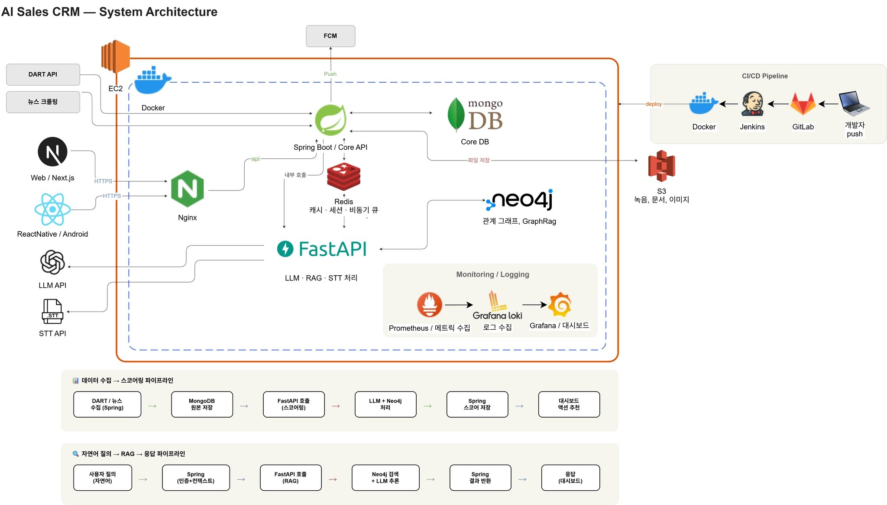

# F!NT — 지능형 영업관리를 위한 인공지능 B2B CRM

> *"기록하는 CRM이 아니라, 행동을 만들어내는 CRM"*

뉴스·공시·미팅 이력을 자동 수집·구조화하고, 영업사원에게 다음 행동(Next Best Action)을 제시하는 B2B CRM.

**SSAFY 14기 자율 PJT** · Team A301 · 철철이형팬클럽 · 2026.04 ~

> 본 문서는 확정 사양이 아닌 **작업 기준선**. 수집 대상·데이터 구조·대시보드 구성은 변경 여지 있음.

---

## 핵심 기능 (3 Layer)

- **Input** — 명함 OCR · 미팅 녹음 STT · Gmail/캘린더/DART/뉴스 자동 수집
- **Knowledge** — 고객 위키 자동 생성 · 미팅 전 자동 브리핑
- **Action** — 자연어 커스텀 대시보드 · Challenger 기반 NBA 추천

**핵심 원칙.** HMI — AI는 추천, 최종 판단과 책임은 사람.

---

## 기술 스택

| 영역 | 스택 |
|------|------|
| Web | Next.js (React) |
| App | React Native (Android, minSdk 35) |
| Backend | Spring Boot (Java) · 메인 API |
| AI | FastAPI (Python) · stateless |
| Data | MongoDB · Neo4j · Redis · AWS S3 |
| Infra | AWS Lightsail XL · Docker Compose · Nginx |
| CI/CD | GitLab → Jenkins → Docker |
| Monitoring | Prometheus · Loki · Grafana |

---

## 아키텍처
- [Git Convention (Notion)](https://www.notion.so/Git-Convention-3324479f510880f6b3b8f812ccf676e6)


상세: [Draw.io](https://drive.google.com/file/d/16TekfqxYtelc9bR-hm7cTv0CNRSkxOSR/view?usp=drive_link)

---

## 프로젝트 구조

```
fint/
├── backend/           Spring Boot (메인 API)
├── ai/                FastAPI (AI 전용)
├── frontend-web/      Next.js
├── frontend-app/      React Native (Android)
├── infra/             Docker Compose · Nginx · 모니터링
├── docs/              설계 문서
├── .claude/           Claude Code rules · skills
└── CLAUDE.md          Claude Code 가이드
```

---

## 시작하기

각 서비스의 README 참고:

- [`backend/fint/README.md`](backend/fint/README.md) — Spring Boot
- [`ai/README.md`](ai/README.md) — FastAPI
- [`frontend-web/README.md`](frontend-web/README.md) — Next.js
- [`frontend-app/README.md`](frontend-app/README.md) — React Native
- [`infra/README.md`](infra/README.md) — Docker Compose (전체 스택 기동)

---

## 문서

### 설계

- [3 Layer 기능 구조](docs/3-layer.md)
- [ERD (MongoDB · Neo4j)](docs/erd.md)
- [API 명세](docs/api.md)
- [AI 파이프라인](docs/ai-pipeline.md)
- [영업 시그널 정의](docs/sales-signals.md) *(검토 중)*
- [Playbook (Challenger · SPIN)](docs/playbook.md) *(검토 중)*
- [대시보드 후보](docs/dashboard-candidates.md) *(검토 중)*

### 개발 컨벤션

- [Git Convention (Notion)](https://www.notion.so/Git-Convention-3324479f510880f6b3b8f812ccf676e6)
- [Jira Convention (Notion)](https://www.notion.so/Jira-Convention-3324479f5108805db009fe8e95e36121)

### 운영

- [인프라 · 배포 · 모니터링](docs/infra.md)
- [Claude Code 가이드](CLAUDE.md)

---

## 팀

| 이름 | 담당 |
|------|------|
| 이세원 | 팀장 · PM · BE · FE|
| 채지원 | BE · FE    |
| 류수정 | BE · FE    |
| 김민재 | BE · FE    |
| 정은지 | BE · Infra |
| 정대철 | BE · Infra |

> 세부 역할(FE / BE / INFRA / AI)은 스프린트 0 확정 후 업데이트.

---

**F!NT** · *Flow + Hint*