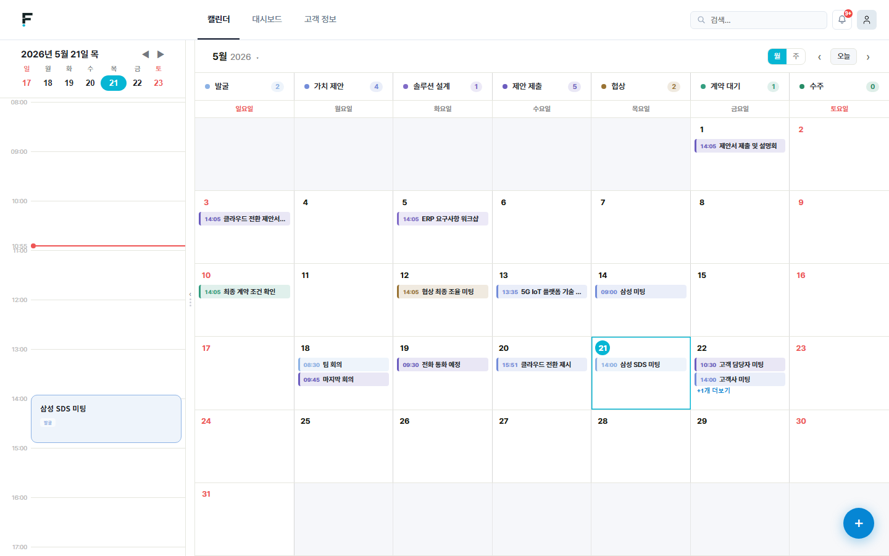
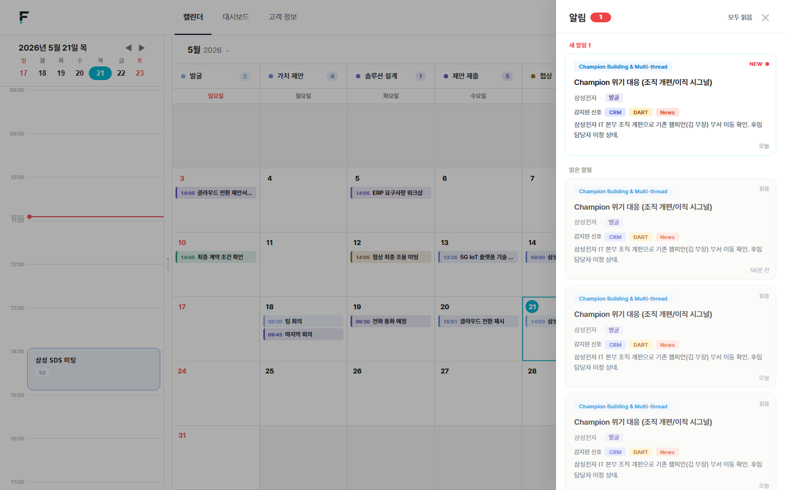
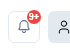
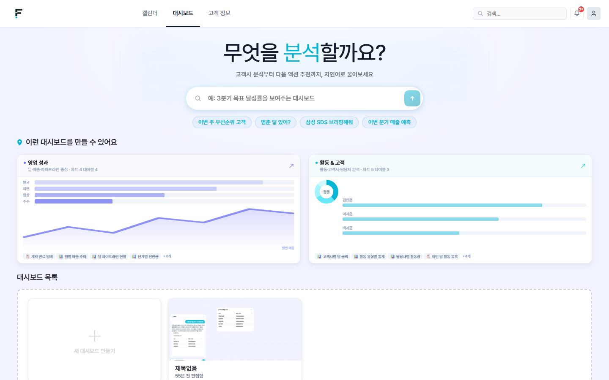
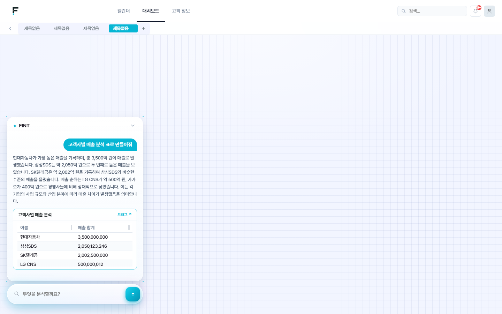
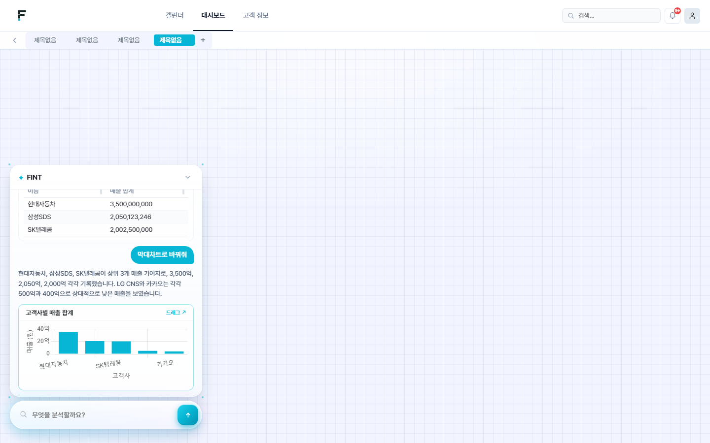
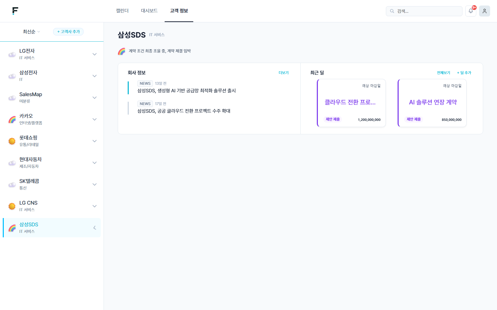
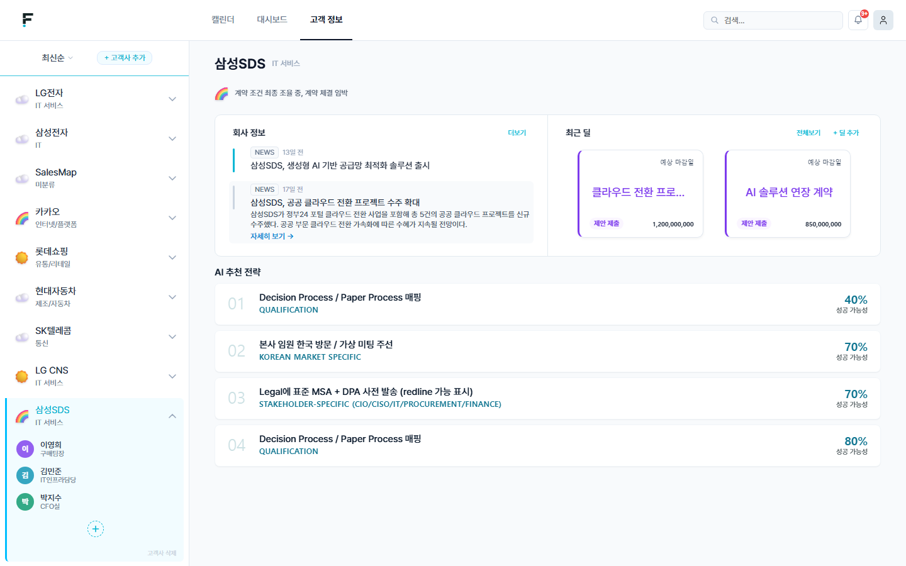

# F!NT 시연 시나리오

> 서비스 도메인: https://k14a301.p.ssafy.io
> 시연 순서: 캘린더·알림 → 대시보드 → 고객사·딜·Next Action

---

## 사전 준비

- 브라우저에 `https://k14a301.p.ssafy.io` 접속 후 로그인 완료 상태 유지
- 시연 계정: 회사코드 `FINT301` / 사번 `EMP001` / 비밀번호 `test1234`
- 삼성SDS 고객사 및 관련 딜 데이터 사전 입력 확인

---

## 1. 캘린더 · 알림

### 화면 1-1. 캘린더

| 순서 | 행동 | 위치 | 설명 |
|------|------|------|------|
| 1 | 캘린더 탭 클릭 | 상단 내비게이션 바 좌측 | 오늘 일정 확인 |
| 2 | **14:00 삼성 SDS 미팅** 카드 확인 | 캘린더 21일 셀 중앙 | 오늘 오후 2시 미팅 표시 |
| 3 | 미팅 브리핑 카드 확인 | 화면 좌측 하단 패널 | 핵심 포인트 정리 내용 |

---

### 화면 1-2. 알림 패널

| 순서 | 행동 | 위치 | 설명 |
|------|------|------|------|
| 4 | 알림 배지  클릭 | 화면 우상단 종 아이콘 | 알림 패널 오픈 |
| 5 | **NEW** 알림 내용 읽기 | 패널 상단 첫 번째 카드 | 뉴스·공시 감지 알림 표시 확인 |

---

## 2. 대시보드

### 화면 2-1. 대시보드 진입

| 순서 | 행동 | 위치 | 설명 |
|------|------|------|------|
| 1 | 대시보드 탭 클릭 | 상단 내비게이션 바 중앙 | 자연어 분석 입력창 표시 |
| 2 | 추천 대시보드 카드 확인 | 화면 하단 카드 목록 | 사전 생성된 위젯 예시 |

---

### 화면 2-2. 자연어 입력 → 표 위젯 생성

| 순서 | 행동 | 위치 | 설명 |
|------|------|------|------|
| 3 | 입력창 클릭 → `고객사별 매출 분석 표로 만들어줘` 입력 후 전송 | 화면 하단 중앙 텍스트 입력창 | AI가 데이터 조회·컴포넌트 조합 후 표 생성 |

---

### 화면 2-3. 막대차트로 변환

| 순서 | 행동 | 위치 | 설명 |
|------|------|------|------|
| 4 | 입력창 클릭 → `막대차트로 바꿔줘` 입력 후 전송 | 화면 하단 중앙 텍스트 입력창 | 표 → 막대차트 위젯 변환 |

---

## 3. 고객사 · 딜 · Next Action

### 화면 3-1. 삼성SDS 고객사 페이지

| 순서 | 행동 | 위치 | 설명 |
|------|------|------|------|
| 1 | **삼성SDS** 클릭 | 화면 좌측 고객사 목록 | 고객사 상세 진입 |
| 2 | **최근 딜** 섹션 확인 | 화면 우측 상단 카드 영역 | 클라우드 전환 프로젝트 ₩1,200,000,000 |
| 3 | 관련 뉴스 확인 | 화면 중앙 회사 정보 섹션 | 삼성SDS 관련 최신 뉴스 표시 |

---

### 화면 3-2. AI 추천 전략 (Next Action)

| 순서 | 행동 | 위치 | 설명 |
|------|------|------|------|
| 4 | **클라우드 전환 프로젝트** 딜 카드 클릭 | 우측 딜 카드 섹션 | 딜 상세 + AI 추천 전략 표시 |
| 5 | **AI 추천 전략** 섹션 확인 | 딜 상세 페이지 하단 | 성공 가능성별 Next Action 리스트 |

